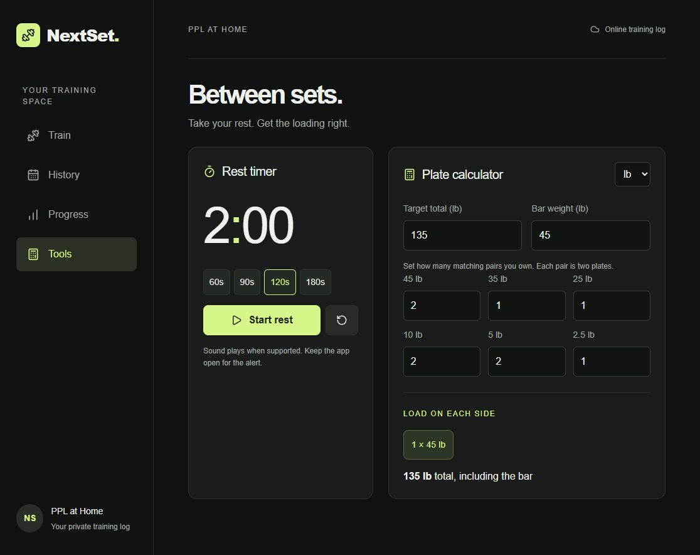

# NextSet

An iPhone-friendly home-gym workout tracker built for Siahverse. Plan your next workout, log each set, and follow your progress without a fixed end date.

**App:** [nextset.siahverse.cc](https://nextset.siahverse.cc) · **Portal:** [Siahverse](https://siahverse.cc)



## Four tabs

**Programs** offers At-Home PPL by Siah and saved commitments. **Train** shows the next workout, weekly streak, timer, and calculator. **Analytics** combines weekly summaries, PRs, muscle coverage, and history. **Nexus** is the upcoming AI trainer; live coaching and the strength score are not yet connected. See [the roadmap](ROADMAP.md).

## Features

- **PPL at Home:** two lower-volume re-entry weeks with three workouts each: Push, Pull, and Legs.
- **Gradual progression:** 3–4 reps in reserve during re-entry. Week 2 suggests a small weight increase only after the target reps, good form, and sufficient RIR are logged. Weight changes always remain manual.
- **Ongoing training:** the later six-day PPLPPL workouts remain intact; the final training week repeats indefinitely with separate logs for each new week.
- **Set logging:** weights, reps, RIR, form checks, completion, saved drafts, and workout history.
- **Progress:** completed workouts, training volume, and personal records.
- **Rest timer:** presets, pause/reset, and an optional sound alert.
- **Plate calculator:** pounds or kilograms, adjustable bar weight, available plate pairs, and the closest achievable load below the target.
- **Private records:** server-side ownership checks keep each person's logs separate.

## Project status

Email/password accounts support signup confirmation, sign-in, and password recovery without a ChatGPT account. Workout data remains private even though the app and this source repository are publicly accessible. The previous ChatGPT account is supported only for existing users and verified import.

See [email account transition](EMAIL-ACCOUNTS.md) for the transition notes and validation status.

## Stack

TypeScript, React, Vinext/Vite, Cloudflare Workers, Cloudflare D1, Drizzle, Zod, and Supabase Auth. Sites manages the current production deployment and custom domain.

## Run locally

Requires Node.js 22.13 or newer.

```sh
npm ci
npm run dev
```

Open the localhost address printed by the development server. The portable starter supports simulated sign-in for local development only. Apply the included D1 migration before using local workout persistence:

```sh
npm run build
npx wrangler d1 execute site-creator-d1 --config dist/server/wrangler.json --local --persist-to .wrangler/state --file drizzle/0000_orange_rhino.sql
npx wrangler d1 execute site-creator-d1 --config dist/server/wrangler.json --local --persist-to .wrangler/state --file drizzle/0001_solid_scalphunter.sql
```

For your own deployment, configure your own database binding and authentication project. The Supabase URL and publishable key in `lib/email-config.ts` are public client configuration, not administrative credentials. Never add service-role keys, passwords, database exports, or real workout records to Git.

## Check and build

```sh
npx tsc --noEmit
npm run build
```

## Code map

| Location | Responsibility |
| --- | --- |
| `app/workout-app.tsx` | Training, history, progress, timer, and calculator UI |
| `lib/reentry.ts` | Re-entry workouts, progression suggestions, and plate calculations |
| `lib/program.ts` | Week selection and unlimited continuation |
| `app/api/workouts/route.ts` | Validated, user-scoped workout persistence |
| `app/account/` | Email account forms |
| `app/email-auth.ts` | Server verification of email-account identity |
| `app/api/account/import/` | Verified import from the previous account without replacing existing entries |
| `db/`, `drizzle/` | D1 schema and migrations |

## Program attribution

The later training phase is based on the user-selected [Hulkerz PPLPPL program on Boostcamp](https://www.boostcamp.app/users/ImldmW-hulkerz-ppl). NextSet is an independently built app and is not affiliated with Boostcamp. Program content retains its original attribution; publication of this repository does not claim ownership of that program.

Built by Siah for personal training, family, and the Siahverse portfolio.

## Program library

At-Home PPL remains unchanged. The library also tracks the [r/Fitness Basic Beginner Routine](https://thefitness.wiki/routines/r-fitness-basic-beginner-routine/) and [Dumbbell Stopgap by Cammorak](https://old.reddit.com/r/Fitness/comments/zc0uy/a_beginner_dumbbell_program_the_dumbbell_stopgap/). These are community-authored routines, not NextSet coach partnerships. Their instructions are paraphrased and linked; no original articles or paid plans are bundled. Stopgap uses the published lunge option. Separate program records preserve legacy PPL logs.

New commitments require a review and typed I agree. Run `node tests/catalog.mjs` for program schedules and SQLite-backed route checks; authentication is stubbed at the boundary in that test. Live Supabase email end-to-end testing remains separate.
